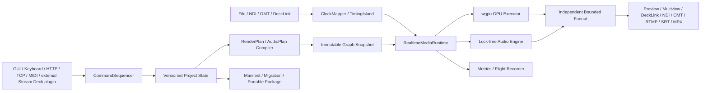

# eiviz 技術設計・完全実装計画

## 調査結果と前提
- 対象は [Issue #1](https://github.com/MikanseiLaboratory/eiviz/issues/1)。workspace skeleton と一部の決定論的model/testは存在しますが、実GPU、実file video、実I/O、production codec、HILは未完了です。コードが存在するだけでは実装済みと数えません。
- Rust 2024 edition、Windows first、wgpu中心のnative GUI applicationとします。公開版 [`gpu-video 0.4.0`](https://crates.io/crates/gpu-video) はMIT・wgpu 29・Vulkan Video依存ですが、upstream masterは既にwgpu 30へ進んでいます。したがってPhase 0で互換性セットを実測し、`Cargo.lock`と [technologystack.md](technologystack.md) にexact pinします。
- Smelter本体は製品組込みに商用ライセンスが必要なため非採用です。合成はeiviz独自wgpu compositor、gpu-videoはMITのoptional hardware codec候補です。gpu-videoを採用する場合もVulkan Video/HILとwgpu世代統合を完了するまで「使用中」と表記しません。
- 最初の正式認定は `1920x1080p 60000/1001 fps、SDR BT.709、8-bit、48kHz audio`。4K、HDR、10-bit、interlaceは同じformat/capability model上の後続認定profileとし、設計上の行き止まりを作りません。
- 「無限」は固定された製品上限がないことと定義します。実行時はVRAM、帯域、codec session、device能力を見積もるadmission controlにより、安全に追加を拒否できます。
- 汎用OS上でhard real-timeは保証できないため、「厳密fps」は有理数timestampに累積誤差がないことと、認定環境でdeadline/drop/xrun基準を満たすことに分けて判定します。

## 現在の実装事実（2026-08-24）

| 領域 | 到達段階 | 未達 |
|---|---|---|
| Core/Time/Command | Model only〜Runtime wired | immutable snapshot swap、queue full、transaction、長時間replay証跡 |
| Project | Adapter code | 完全migration、portable別PC、corrupt/disk-full/fuzz/24h |
| Compositor | CpuReferenceのみ | 実WGSL compositor、texture pool、prewarm、device-loss、GPU HIL |
| File media | PNG/JPEG静止画 | H.264 decode、play/pause/seek/loop、A/V sync |
| Mixing/Audio | 一部Runtime wired | Multiview実描画、production ASRC、device callback、24h |
| OMT | Runtime wired（公式C ABI、映像・音声receive/send、GUI接続） | 公式binaryとの実機interop、tally/metadata、reconnect実証、network fault |
| NDI/DeckLink/ASIO | Model/stub only | SDK実装、Runtime配線、HIL |
| Encode/stream | test用I_PCM/mux helper | production AVC/AAC、RTMP/SRT session、回復、24h |
| Control | HTTP/TCP一部 | WebSocket、MIDI実入力、権限、transaction、flood |
| Certification | 文書のみ | Windows実機、GPU/SDK HIL、24–72h、installer/signing |

この表の `未達` が空になり、対応試験証跡が保存されるまで当該Phaseを完了にしません。

## 要件定義
- `R01 Project`：create/save/load、schema version、migration、atomic save、autosave/recovery、欠落asset/device診断を実装します。通常projectはmanifest＋外部asset参照、portable exportはcontent-addressed assetを同梱した `.eiviz` archiveとし、秘密情報とnative handleは保存しません。
- `R02 Input/Scene`：image、video、NDI、OMT、DeckLink、audio deviceをProject全体のflat Inputとして一意ID管理し、tag/groupを付与します。SceneはInput参照とtransform/crop/rotation/opacity/playback設定を持ち、mouse editorは同じdomain commandだけを発行します。
- `R03 Mixing`：各Mixing UnitはPRV/PGM、transition、ordered Overlay slots、Audio Follow policy、複数Output、複数Multiviewを所有します。Mixing Unit出力は別Unitから参照できますが、接続graphはDAGとしcycleを拒否します。Overlayは独自描画型を増やさずScene参照としてSceneItemの変形・合成機構を再利用します。
- `R04 Timing`：frame rate/time baseを整数比で保持し、59.94は常に`60000/1001`。`frame_pts(n)=n*1001/60000`、48kHz境界は`floor(n*48000*1001/60000)`で算出し、丸め加算を禁止します。DeckLink/genlock、PTP、audio sample clock、OS monotonicを別clock domainとしてmapperで関連付けます。
- `R05 GPU/Media`：wgpuの単一Device/Queue所有者、immutable RenderPlan、demand-driven super-DAG、texture pool、pipeline prewarm、shader/color conversionを実装します。Programを最優先し、Preview/Multiviewは負荷時にrefresh/resolutionを落とせますが、Program format/cadenceは暗黙変更しません。
- `R06 Audio`：planar float internal format、Audio Bus/Matrix、gain/pan/mute/solo、delay compensation、resampling、meteringを実装します。route modeは`Manual`または`Follow(MixingUnit)`、manual muteを最優先とし、TAKE時のfollow activationは映像と同じ論理境界で確定します。
- `R07 I/O`：NDI送受信は`grafton-ndi`、OMTは公式C ABI/Rust wrapperをfeature-gated adapter、DeckLinkは公式SDK用の最小C++/C ABI shim、audioはCPALのASIO/WASAPI/CoreAudio/ALSA系backendとして隔離します。SDK未導入時もcore applicationは起動し、capability不足を表示します。
- `R08 Distribution`：RTMPはH.264/AAC in FLV、SRTはH.264/AAC in MPEG-TS、録画はfragmented MP4をbaselineとし、同一encoding profileだけaccess unitをfan-outします。各sinkは独立bounded queue/reconnect stateを持ち、disk fullやslow sinkでProgramを停止させません。GStreamerを第一候補、FFmpegを代替候補としてPhase 0で配布・license・latencyを比較します。
- `R09 Command`：UI、keyboard、HTTP、TCP、MIDIを共通versioned `CommandEnvelope`へ変換します。Stream Deck固有ロジックはout-of-tree pluginに置き、eivizは同じHTTP/TCP APIだけを提供します。単一sequencerがID、client sequence、expected revision、effective media timeを検証・全順序化し、frame/audio buffer境界でimmutable planをatomic swapします。「順次処理」はstate mutationの確定順序だけを指し、network/file/GPU処理を直列実行しません。
- `R10 Operations`：structured logs、metrics、30–60秒のflight recorder、frame ID追跡、crash report、capability reportを提供します。deadline slack、drop/repeat、A/V drift、queue high-water、xrun、GPU pass time、device lossをrelease gateにします。
- `R11 Portability/Security`：Windows x64を必須gate、Linux x64とmacOS arm64をplatform capability profileで継続検証します。HTTP/TCPはlocalhost既定、remote enable時は認証・権限・rate limit・idempotencyを必須にします。

## 不変条件
- 永続IDはProject内で一意。SceneはInputを所有せず参照し、OS handle、FFI pointer、GPU resourceは永続化しません。
- TAKE、transition確定、Overlay、Audio Followは一つのlogical frame boundaryで原子的に反映します。
- render/audio graph activation前に参照、cycle、format、capacityを検証し、live threadは検証済みimmutable snapshotだけを読みます。
- callback内ではallocation、blocking mutex、file/network I/O、同期log、GPU wait、panic越境を禁止します。
- すべてのqueueはbounded。Program、audio cadence、他Outputへbackpressureを伝播させません。
- 欠落asset/deviceを暗黙置換せず、freeze/slate/transparent/fail等の事前設定policyを適用します。
- compositor、codec、audio/device backendはProject/profileで明示選択し、利用不能時に別backendへ暗黙切替しません。CIの`CpuReference`は明示profileでありGPU fallbackではありません。

## 技術構成と依存方向

- [Cargo.toml](Cargo.toml)：workspaceとdependency policy。
- [apps/eiviz-desktop](apps/eiviz-desktop)：native entry point。GUI候補はwgpu互換性が高いegui/eframeとし、PresentationはCommand/Query境界より内側へ入れません。
- [crates/eiviz-core](crates/eiviz-core)：Project、Input、Scene、MixingUnit、Output、Audio model。外部SDK/wgpu非依存。
- [crates/eiviz-time](crates/eiviz-time)：rational time、clock mapping、virtual clock、Timing Island。
- [crates/eiviz-command](crates/eiviz-command)：commands、reducer、sequencer、event/replay。
- [crates/eiviz-project](crates/eiviz-project)：schema、migration、atomic save、asset store、export/import。
- [crates/eiviz-media](crates/eiviz-media)：video/audio/packet contract、format/capability、bounded queue policy。外部crate型を公開しません。
- [crates/eiviz-runtime](crates/eiviz-runtime)：graph compiler、scheduler、admission control、failure supervision。
- [crates/eiviz-gpu](crates/eiviz-gpu)：wgpu runtime、compositor、WGSL、resource pool、device recovery。
- `crates/eiviz-codec-*`、`crates/eiviz-io-*`：gpu-video、Smelter PoC、GStreamer、NDI、OMT、DeckLink、CPAL/ASIOを個別crate/featureに隔離します。
- [crates/eiviz-control](crates/eiviz-control)：HTTP/WebSocket、TCP framing、MIDI。Stream Deck固有adapterは置きません。
- [docs/requirements.md](docs/requirements.md)、[docs/architecture.md](docs/architecture.md)、[docs/adr](docs/adr)、[technologystack.md](technologystack.md)、[directorystructure.md](directorystructure.md)：要件ID、判断根拠、version/license、機能差、試験証跡のsource of truth。

依存方向は `app/adapters -> runtime -> core/time/media` の一方向にし、coreからGUI、Tokio、wgpu、GStreamer、native SDKを参照しません。Tokioはcontrol/network、Rayonはadmission-controlledなCPU作業、deadline thread/audio callback/GPU submitは専用threadで所有します。

## 実装フェーズ
0. **Gate 0 — 実装事実の再確立**
   - 各要件を `Not started / Model only / Adapter code / Runtime wired / Interop tested / Certified` の6段階で記録します。
   - `Runtime wired` 未満を「動く」と表現せず、`Interop tested` 未満を実I/O完了、`Certified` 未満をPhase完了と表現しません。
   - exit：全要件に実装箇所、試験ID、未達、次の依存が紐付き、stub/模擬loopbackを完了扱いした記録がありません。
1. **Phase 0 — 要件凍結・PoC・法務ゲート**
   - 上記docs、ADR、workspace skeleton、CIを作成し、認定reference hardwareと最低capacity（Input/Unit/Overlay/Output数、A/V latency、P99 budget）を固定します。
   - Smelter本体 vs gpu-video単独、wgpu 29公開版 vs追従候補、Vulkan Video/DX12 interop、egui texture sharing、GStreamer/FFmpeg、NDI/OMT/DeckLink/ASIOのbuild/distributionを独立spikeで計測します。
   - exit：採用backend、exact versions、license/SBOM、copy回数、明示profile、macOS codec経路をADRで承認。失敗したPoCをmain runtimeへ持ち込みません。
2. **Phase 1 — 決定論的walking skeleton**
   - synthetic video/1kHz audio → Command Queue → single Mixing Unit → **実wgpu preview**、project save/loadを通します。CpuReferenceだけではPhase 1完了にしません。
   - virtual clockで長時間相当の`60000/1001`と800/801 audio cadence、command replay、atomic snapshot、queue overflowをproperty testします。
3. **Phase 2 — GPU compositorと編集GUI**
   - PRV/PGM、cut/transition、SceneItem transform/crop/opacity、mouse hit-test、ordered Overlay、shader pipeline cache、device loss復旧を実装します。
   - NVIDIA/AMD/Intelでgolden frameとP99 GPU budgetを検証し、UI負荷がProgram cadenceへ影響しないことを確認します。
4. **Phase 3 — File mediaとProject portability**
   - image、H.264 video、play/pause/seek/loop、A/V sync、content hash asset store、migration、autosave/recovery、portable `.eiviz` export/importを実装します。
   - corrupt media、missing asset、disk full、旧schema、別PC pathでfuzz/round-trip/24h loop試験を行います。
5. **Phase 4 — 完全なMixing/Audio model**
   - 複数Mixing Unit DAG、nested program reference、複数Output/Multiview、Audio Bus/Matrix/Follow、metering、ASRC、delay compensationを実装します。
   - slow auxiliary sink、source loss、sample-rate差、unit cycle、最大認定graphをmodel-based testと24h soakで検証します。
6. **Phase 5 — AV-over-IP adapters**
   - OMTとNDIを別vertical sliceで receive → Runtime registry → mix/audio-follow → send まで実装し、discovery、tally/metadata、timestamp、reconnectをreference tool/別PCと相互運用試験します。
   - OMTは公式MIT `libomt` C ABIをruntime loadします。`EIVIZ_OMT_LIBRARY`またはplatform標準名で解決できない場合はUnavailableとし、SimulatedOmtへ切り替えません。Windows/macOS公式binary、Linux source buildを別profileとして検証します。
   - jitter/loss/reorder/NIC断/帯域飽和を注入し、各adapterをfeature-gated failure domainとして認定します。
7. **Phase 6 — Broadcast hardware**
   - DeckLink capture/scheduled playbackとASIO input/outputを実装し、genlockあり/なしを別contractで扱います。DeckLink `duration=1001, timescale=60000`、ASIO callbackのlock-free経路、hotplug/mode changeを検証します。
   - private HIL runnerでreference generator、DeckLink loopback、ASIO interfaceを用い、A/V skew、schedule miss、xrun、driver restartを測定します。
8. **Phase 7 — Encode・stream・record**
   - 明示gpu-video profileまたは明示software/OS codec profile、GStreamer mux/transport、RTMP/SRT/fMP4、keyframe/reconnect/segment recovery、sink isolationを実装します。暗黙fallbackは禁止です。
   - packet PTS/DTS、59.94 signaling、A/V sync、disk full、5% loss、server断、3出力同時24hを検証します。
9. **Phase 8 — Control plane完成**
   - UI/keyboard/HTTP/TCP/MIDIへ共通contract testを適用し、auth、revision conflict、idempotency、queue full、transaction、event subscriptionを完成させます。Stream Deck pluginはこのHTTP/TCP contractをout-of-treeで検証します。
   - 複数clientのcommand flood/replayで同じeffective frameとstate hashへ到達することを確認します。
10. **Phase 9 — Cross-platform・追加映像profile・release認定**
   - Linux/macOS backend、4K、HDR/10-bit、interlaceをcapability profile単位で追加し、Windows projectの移植、unsupported capability診断、installer/signing/upgrade/rollbackを検証します。
   - Windows必須、Linux/macOS nightly、実GPU/HIL private runner、72h release soak、障害注入、license notice/SBOMを全てrelease evidenceとして保存します。

## 完了判定とトレーサビリティ
- 各要件IDに実装PR、unit/property/integration test ID、HIL scenario、対応OS、実測値、既知制限を紐付けます。Phaseは「コードが存在する」ではなく証跡が揃った時だけ完了です。
- baseline acceptance：有理数由来の累積drift 0、認定負荷24hで内部要因のProgram drop/repeatとaudio xrun 0、A/V syncはlock後P99 ±1ms・最大±5msを暫定目標、補助sink停止でProgram影響0、command replayのeffective frame/state hash一致とします。Phase 0実測で不可能なら黙って緩和せず、ADRと要件変更承認を必須にします。
- callback allocation/blocking検査、Loom/Miri/ sanitizer対象、WGSL validation、golden image許容誤差、migration/fuzz、network impairment、GPU/device/disk failure、24–72h soakをrelease gateにします。
- 4K/HDR/interlaceはbaselineと同じcore modelを再利用し、format conversion、color management、resource budget、HIL profileだけを追加します。platformやSDK非対応機能を「実装済み」と数えません。