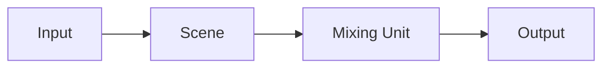

The same idea as Input, Source, or a camera tally on other tools. In eiviz the path is **Input → Scene → Mixing Unit → Output**. Switching itself is the Mixing Unit.

| | Role |
| --- | --- |
| Input | A video source: camera, file, NDI/OMT, colour, and similar |
| Scene | Inputs stacked as layers |
| Mixing Unit | Puts Scenes on Preview/Program; CUT, AUTO, or T-bar switches them |
| Output | Sends the chosen source over NDI/OMT |

An Output’s source can be an Input, a Scene, Mixing Unit Preview/Program, or a Multiview. The default is Mixing Unit Program. Inputs can also sit directly on a Mixing Unit or an Output.

## Kinds

Add them from Inputs in the main window.

- Colour / bars / black
- Still
- Video file
- UVC (capture device)
- NDI / OMT

Use an Input as a Scene layer, a Mixing Unit bus, a Multiview tile, or an Output source.

[Scenes](/concepts/scenes/) · [Mixing Unit](/concepts/mixing-unit/) · [Outputs](/concepts/outputs/)
