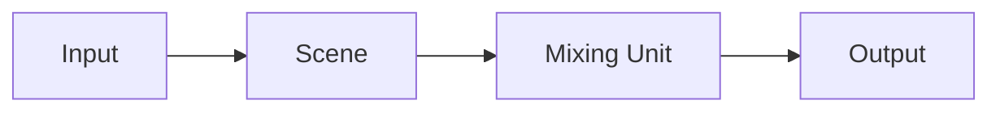

The same idea as Input, Source, or a camera input on other tools.

| | Role |
| --- | --- |
| Input | A video source: camera, file, NDI/OMT, colour, and similar |
| Scene | Inputs stacked as layers |
| Mixing Unit | Puts Scenes on Preview/Program; CUT, AUTO, or T-bar switches them |
| Output | Sends the chosen source over NDI/OMT |

An Output’s source can be an Input, a Scene, Mixing Unit Preview/Program, or a Multiview. The default is Mixing Unit Program.  
Inputs can also sit directly on a Mixing Unit or an Output.

## Kinds

Add them from Inputs in the main window.

- Colour / bars / black
- Still
- Video file
- UVC (capture device)
- NDI/OMT
- Mix (Mixing Unit Preview/Program, or a session Multiview, plus a 1–8 frame buffer)

A Mix Input is a delayed reroute of an existing bus. It reads N frames ago from the FrameDelay ring and does not add a swapchain. The same Mixing Unit cannot use a Mix Input that targets itself. Nested M/E (Mix of unit A on unit B) is stable with that delay. Mix audio is a delayed copy of one selected Audio Bus, or silence if None.

Use an Input as a Scene layer, a Mixing Unit bus, a Multiview tile, or an Output source.  
Input preview is a GPU readback thumbnail and does not use the video output destination window limit.

## Tags

An Input can have more than one tag. Tags stay in the session catalog, and unused tags still appear as tabs.

### Assign

In Add / Edit Input, check the tags to assign. You can add a new tag from the same dialog.  
One Input can hold several tags.

### Filter the list

Tabs above the Inputs list in the main window are exclusive.

- **All** — every Input
- **Each tag** — only Inputs that have that tag
- **Kind** — Colours / Still / Video / OMT / NDI® / Video Capture / Mix

Changing a tab only filters the list. Mixing Unit and Output pickers still see every Input.

### Manage tags

Right-click the tab strip to add, rename, or delete a tag.

- Rename follows through on every Input that had the old name
- Delete removes the tag from those Inputs. If you were on that tab, the list returns to All

Detail is in [Scenes](/eiviz/en/concepts/scenes/), [Mixing Unit](/eiviz/en/concepts/mixing-unit/), and [Outputs](/eiviz/en/concepts/outputs/).
