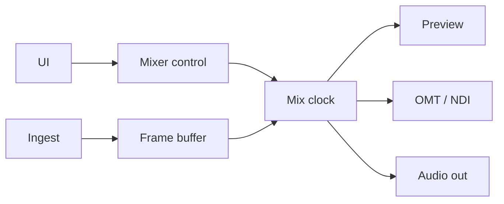
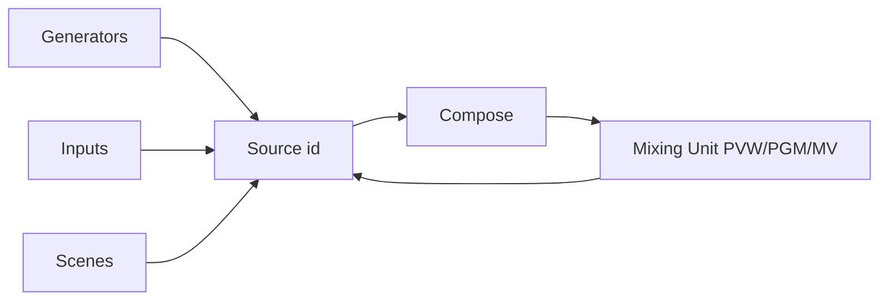
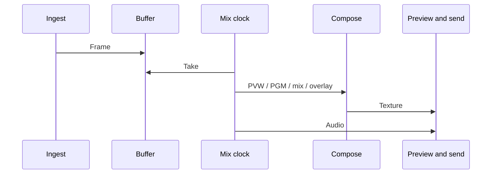

eiviz system architecture. The shape is largely the same across platforms.

## Shape

eiviz runs as one process.  
The video and audio state machine is the mixer (Rust + wgpu). Each OS host talks to it over a C ABI. Windows is WPF; macOS is SwiftUI. There is no Linux host yet.

The host owns windows, interaction, and preview surfaces.  
Compose, audio, I/O, and session data live in the mixer. Keeping that work off the UI is how the stack stays fast and portable.

## Who owns what

| | Mixer | Host |
| --- | --- | --- |
| Compose and transitions | Yes | Sends the gesture |
| GPU and audio devices | Yes | Passes settings |
| Live preview | Draws into a native surface | Supplies the surface (HWND / NSView) |
| Scene tiles and similar | Reads back from the GPU | Shows the thumbnail |

There is one mixer per process. The host never receives GPU pointers except live preview surfaces. Inputs, scenes, and Mixing Units are integer ids.

## Concurrency

The UI thread drives interaction and picture present.  
File, UVC, NDI, and OMT ingest fill buffers on other paths. The mixer takes frames on a fixed interval.

If processing falls behind, compose is skipped and audio still advances so the clock can catch up.  
Video keeps a few frames of buffer so it lines up with audio.

## How sources are named

Generators such as solid colour and colour bars, session inputs, composited scenes, and a Mixing Unit’s Preview / Program / Multiview all live in one **source-id space**.  
That is why one Mixing Unit’s Program can feed another Mixing Unit.

## One frame

A frame goes like this:

1. An ingest thread deposits the latest frame
2. Each Mixing Unit draws Preview and Program, mixes with the T-bar or AUTO, then overlays and multiview
3. The result is sent to the compose buses
4. If needed it is packed for send, or handed on as a GPU texture
5. Audio buses mix on the same tick

## GPU

Compose calls the GPU through a wgpu abstraction. Windows is Direct3D 12; macOS is Metal.  
CPU pictures usually upload through system memory.

On Windows with Resizable BAR on a discrete GPU, the host reaches through wgpu to the DX12 low-level API and writes straight into VRAM.  
Apple Silicon uses unified memory for a similar path.

File and UVC decode on the GPU when they can, then convert into the compose format.  
GPU work is preferred so the CPU can spend time on NDI and other CPU-heavy paths.  
That behaviour can be changed in [Settings](/eiviz/en/introduction/settings/).

## Audio

The internal mix is a 48 kHz graph. Master and Headphone are fixed; AUX buses can be added.  
Inputs have a bus mask and gain. A Mixing Unit can send Program-follow audio (Audio Follow) onto a bus. Overlays can do the same.

Detail is in [Audio Auxs](/eiviz/en/concepts/audio-auxs/).

## Outputs

| | Video | Status |
| --- | --- | --- |
| OMT | Stay on the GPU, or read back and encode on CPU | Shipped |
| NDI | CPU path | Shipped |
| DeckLink | — | In progress |

OMT receive stays full quality on Preview/Program and drops bandwidth otherwise.  
Full quality holds a short time after leaving those buses so TAKE and the T-bar do not rebuild the receiver.

Detail is in [Settings](/eiviz/en/introduction/settings/) → Outputs and [NDI / OMT](/eiviz/en/features/outputs/ndi-omt/).

## Hosts

Live Preview/Program, an open Multiview, Scene Editor, the Overlay window, and a switcher’s Preview/Program are drawn by the mixer into a native surface. Windows uses a child HWND; macOS uses an NSView with a Metal layer from wgpu.

Scene tiles, switcher scene thumbs, and input previews are GPU readback thumbnails. Adding scenes does not add swapchains.

Windows cannot keep many DXGI flip swapchains at once. [Settings](/eiviz/en/introduction/settings/) → Advanced, Video output destination window limit, caps how many may be open. They are used for real-time Preview, Program, and Multiview. A Switcher UI shows Preview and Program, so it uses 2 slots. You can raise the limit, but it may become unstable. Closing a window detaches its swapchain and frees a slot. Closing the main window closes the extra windows and exits the process.

Reloading a session rebuilds the main window so preview surfaces attach on first layout. HWNDs are not reused across mixer lifetimes.
