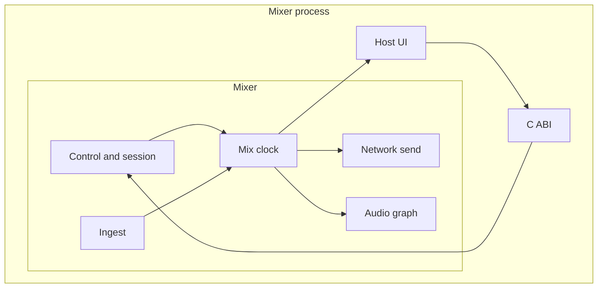
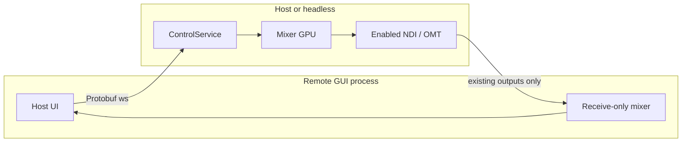
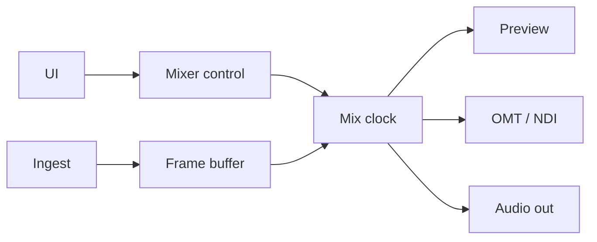
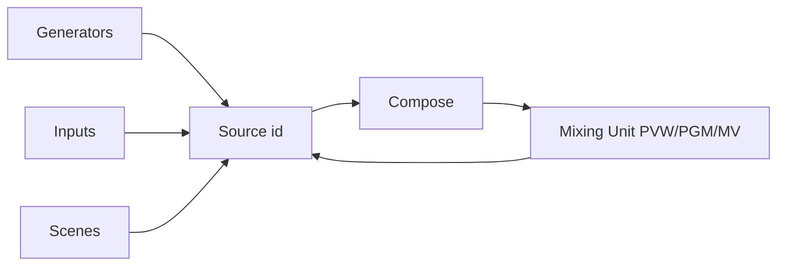
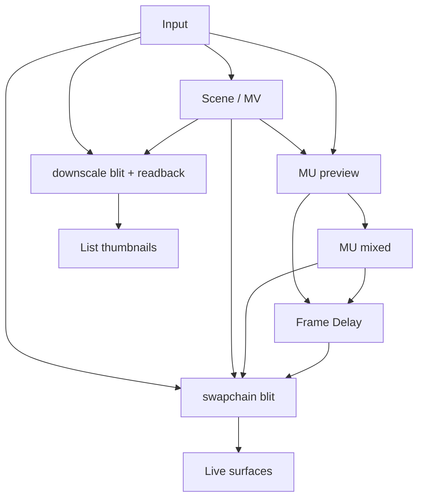
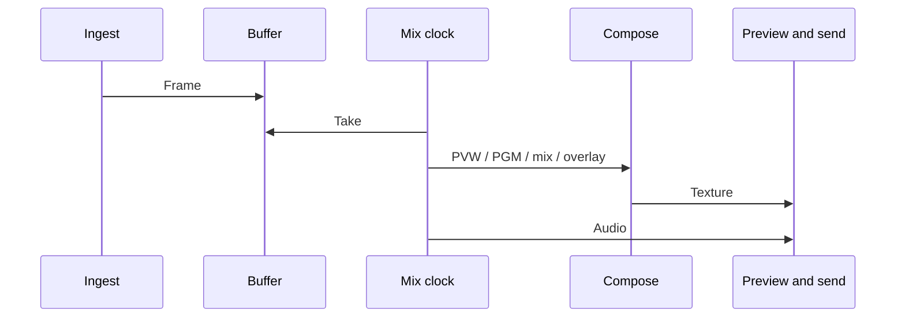

eiviz system architecture. The shape is largely the same across platforms.

## Shape

eiviz compositing runs as one mixer process.  
The video and audio state machine is the mixer (Rust + wgpu). Each OS host talks to it over an internal C ABI. Host code lives in `hosts/win32` (WPF), `hosts/macos` (SwiftUI), and `hosts/linux` (in development).

The host owns windows, interaction, and preview surfaces.  
Compose, audio, I/O, and session data live in the mixer. Keeping that work off the UI is how the stack stays fast and portable.

External control is owned by `ControlService` inside the mixer. vMix-compatible HTTP (default 8088), vMix-compatible TCP (8099), and Protobuf WebSocket (default 9400) all enter the same dispatcher. The C ABI is the host↔mixer FFI, not a public API. API listen (bind, token, media directory) is host-owned; it is not stored in session JSON.

Windows and macOS can also run as a **remote GUI**. That is a second process: the UI still loads a local mixer for NDI/OMT receive and HWND/NSView present, but it never `SessionReplace`s the remote document onto the client GPU. Live ops and session edits go to the host `ControlService` over authenticated `ws://` on a trusted LAN or VPN. TLS is not provided in this release. Details are in [eiviz API](/eiviz/en/developers/api/).

## Who owns what

| | Mixer | Host |
| --- | --- | --- |
| Compose and transitions | Yes | Sends the gesture |
| GPU and audio devices | Yes | Passes settings |
| Live preview | Draws into a native surface | Supplies the surface (HWND / NSView) |
| Scene tiles and similar | Reads back from the GPU | Shows the thumbnail |

There is one mixer per process. The host never receives GPU pointers except live preview surfaces. Inputs, scenes, and Mixing Units are integer ids.

A remote GUI keeps a second, receive-only mixer. It binds Preview/Program/Multiview only when the host already has exactly one matching NDI or OMT output. Missing or duplicate outputs show Unavailable. eiviz does not create extra outputs. Input Preview and scene thumbnails stay off.

## Remote GUI

The remote client and the local host share the same Windows and macOS UI. Preferences chooses Local or Remote. Settings on a remote client is view-only; client-local Preferences (language, connection, listen token on a host) stay editable.

Session edits use typed `MutateSession` with `expected_revision`. Conflicts reload; there is no silent merge. Still/Video add uploads the client file into the host media directory, then adds an Input on the host. Live Mixing Unit ops (`Cut`, `Preview`, `Auto`, overlays) go through the same `ControlService` as `eivizctl`.

## Concurrency

The UI thread drives interaction and picture present.  
File, UVC, NDI, and OMT ingest fill buffers on other paths. The mixer takes frames on a fixed interval.

If processing falls behind, compose is skipped and audio still advances so the clock can catch up.  
Video keeps a few frames of buffer so it lines up with audio.

## How sources are named

Generators such as solid colour and colour bars, session inputs, composited scenes, and a Mixing Unit’s Preview / Program / Multiview all live in one **source-id space**.  
That is why one Mixing Unit’s Program can feed another Mixing Unit.

## Textures

Inputs, scenes, a Mixing Unit’s Preview/Program, and Multiview all live in one source-id space as **GPU textures**. Compose and the GUI sample those `TextureView`s.

| Kind | What it is |
| --- | --- |
| Input | Ingest result. GPU ingest shares the handle; CPU ingest overwrites one texture |
| Scene | Composited layers |
| Multiview | The same scene object, plus labels and tallies |
| Preview | The Mixing Unit `preview` bus |
| Program | `mixed` after mix and overlays. GUI and send point here |

Program keeps a pre-mix `program` target and the on-air `mixed` target. Compose draws live scenes. Session scene textures stay allocated.

### Path to the GUI

The host supplies the window surface; the mixer draws into it. There are two paths.

Live Preview/Program, an open Multiview, Scene Editor, and the Overlay window blit an existing view into an HWND / NSView swapchain. Several live surfaces of the same source each blit that view.

Input lists, scene lists, and switcher source buttons read back a downscale (up to 960×540).

### GPU copies

These copies run in the frame:

- Frame Delay. Copies `mixed` and `preview` into a ring so picture lines up with audio. GUI Preview/Program sample that delayed surface
- Transition history. Copies `mixed` into `prev`
- Send. If CPU encode is selected, the frame is read back as UYVY, then converted to the VMX codec and sent on a dedicated CPU send thread. GPU OMT copies into a per-output send slot

Intermediate buffers such as sort / flow / bloom stay in VRAM. Their compute runs during those transitions.

## One frame

A frame has three lanes:

1. On-air ingest — every master frame
2. On-air compose (Preview/Program/outputs) — every master frame
3. Monitor compose (scene tiles, input preview) and ingest for those sources — present interval

On-air sources upload every master frame. Monitor and thumbnail Inputs upload on their present interval. OMT receive quality reads every attached monitor and thumb each tick.

Then the picture moves like this:

1. An ingest thread deposits the latest frame
2. Each Mixing Unit draws Preview and Program, mixes with the T-bar or AUTO, then overlays and multiview
3. Outputs that send pack UYVY or copy into a GPU slot
4. One thread is assigned per output to compress and transmit
5. Audio buses mix on the same master tick and ride those outputs. When Multiview is selected as the video source, audio cannot be sent

## GPU

Compose calls the GPU through a wgpu abstraction. Windows is Direct3D 12; macOS is Metal.  
CPU pictures usually upload through system memory.

On Windows with Resizable BAR on a discrete GPU, the host reaches through wgpu to the DX12 low-level API and writes straight into VRAM.  
Apple Silicon uses unified memory for a similar path.

File and UVC decode on the GPU when they can, then convert into the compose format.  
GPU work is preferred so the CPU can spend time on NDI and other CPU-heavy paths.  
That behaviour can be changed in [Settings](/eiviz/en/introduction/settings/).

## Audio

The internal mix is a 48 kHz graph. Master and Headphone are fixed; AUX buses can be added.  
Inputs have a bus mask and gain. A Mixing Unit can send Program-follow audio (Audio Follow) onto a bus. Overlays can do the same.

Detail is in [Audio Auxs](/eiviz/en/concepts/audio-auxs/).

## Outputs

| | Video | Status |
| --- | --- | --- |
| OMT | Stay on the GPU, or read back as UYVY and convert to VMX on a dedicated send thread | Shipped |
| NDI | CPU path | Shipped |
| DeckLink | — | In progress |

One thread is assigned per output.

OMT receive stays full quality on Preview/Program and drops bandwidth otherwise.  
Full quality holds a short time after leaving those buses so TAKE and the T-bar do not rebuild the receiver.

Detail is in [Settings](/eiviz/en/introduction/settings/) → Outputs and [NDI / OMT](/eiviz/en/features/outputs/ndi-omt/).

## Hosts

Per-OS hosts live in `hosts/win32`, `hosts/macos`, and `hosts/linux`. Live Preview/Program, an open Multiview, Scene Editor, the Overlay window, and a switcher’s Preview/Program are drawn by the mixer into a native surface. Windows uses a child HWND; macOS uses an NSView with a Metal layer from wgpu.

On a remote GUI those live surfaces sample NDI/OMT receivers instead of the host GPU scene. Scene tiles, switcher scene thumbs, and input previews are GPU readback thumbnails locally; remotely they are placeholders. Adding scenes or Mix Inputs does not add swapchains. A Mix Input is a delayed alias of a Mixing Unit bus or a session Multiview; it reads the FrameDelay ring and uses the same thumbnail path.

Windows cannot keep many DXGI flip swapchains at once. [Settings](/eiviz/en/introduction/settings/) → Advanced, Video output destination window limit, caps how many may be open. They are used for real-time Preview, Program, and Multiview. A Switcher UI shows Preview and Program, so it uses 2 slots. You can raise the limit, but it may become unstable. Closing a window detaches its swapchain and frees a slot. Closing the main window closes the extra windows and exits the process.

Reloading a session rebuilds the main window so preview surfaces attach on first layout. HWNDs are not reused across mixer lifetimes.
