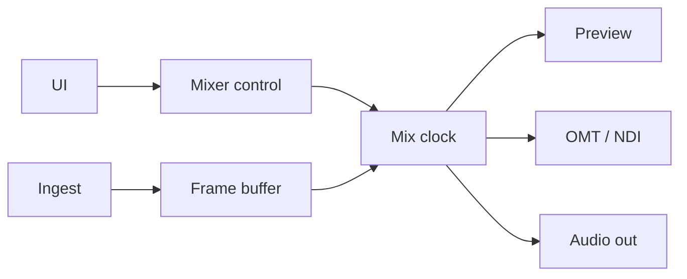
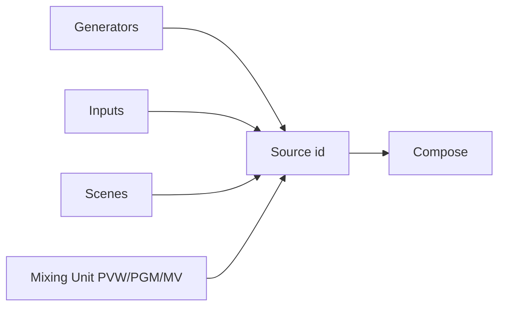
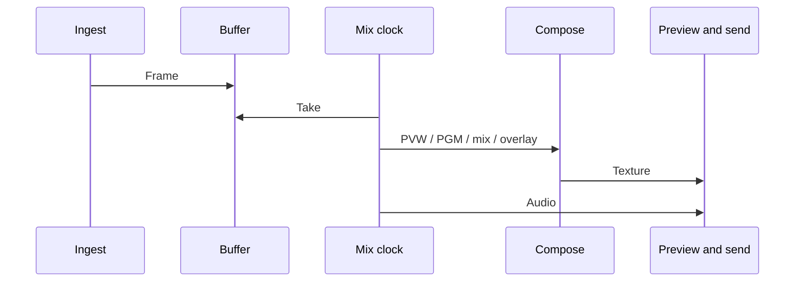
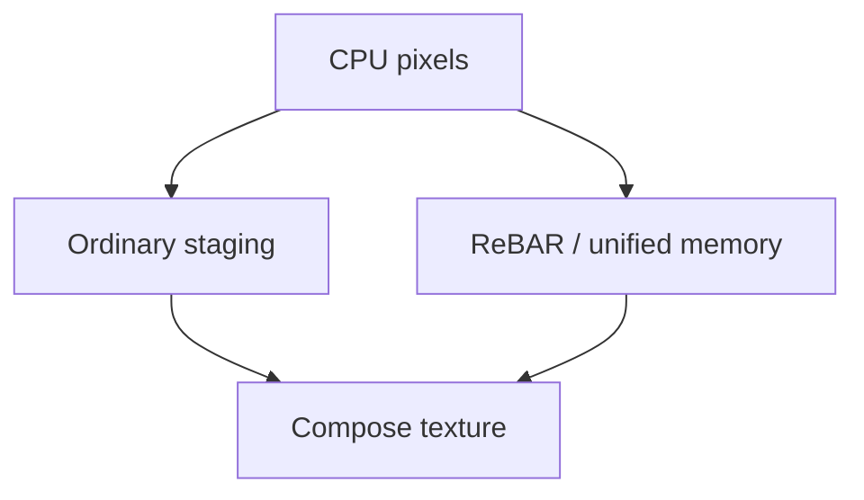

A map for implementers. It deliberately avoids file and function names. Concepts live under [Concepts](/concepts/inputs/). Stack choices live in [About eiviz](/introduction/about/).

## Shape

One process. The video and audio state machine is the mixer (Rust + wgpu). Each OS host talks to it over a C ABI. Windows is WPF; macOS is SwiftUI. There is no Linux host yet.

The host owns windows, interaction, and preview surfaces. The mixer owns compositing, ingest, network send, and canonical session JSON.

## Who owns what

| | Mixer | Host |
| --- | --- | --- |
| Compose and transitions | Yes | Sends the gesture |
| GPU and audio devices | Yes | Passes settings |
| Preview | Draws into a native surface | Supplies the surface (HWND / NSView) |
| Session file | Source of truth; load, save, canonicalize | Keeps an editing copy; reapplies after open |
| Windows and theme | No | Yes |

There is one mixer per process. The host never receives GPU pointers except the preview surface. Inputs, scenes, and Mixing Units are integer ids.

## Concurrency

The UI thread only drives interaction and surface lifetime. A mix clock runs compose and preview present at master FPS. File, UVC, NDI, and OMT ingest fill buffers on other paths; the clock samples them. Network send and audio device I/O stay off the clock as well.

If the clock falls behind, compose is skipped and audio still advances so a stuck preview does not bank up sound. Video is delayed a few frames to line up with audio.

Windows queues slow work off the UI. The T-bar stays synchronous so it can track every frame. macOS creates preview surfaces on the AppKit main thread only.

## How sources are named

Generators (color, bars), user inputs, composited scenes, and a Mixing Unit’s Preview / Program / Multiview all live in one source-id space. That is why one unit’s Program can feed another unit.

## One frame

Ingest deposits a frame → the clock snapshots it → each Mixing Unit draws Preview and Program, mixes with the T-bar or AUTO, then overlays and multiview → present to the preview surface → pack or keep on GPU for send → mix audio buses on the same tick.

CUT swaps immediately. AUTO moves mix over time. The T-bar writes mix from the host. FADE and DIP are how the shader reads that mix.

## GPU

Compose sits on wgpu: Direct3D 12 on Windows, Metal on macOS. The default CPU-pixel path stages through system memory.

On Windows discrete GPUs with Resizable BAR, the CPU writes closer to VRAM, then a copy fills the compose texture. Integrated UMA adapters do not take that shortcut. Apple Silicon uses unified memory for a similar effect. Intel Mac iGPUs are out of scope.

File and UVC decode on the GPU when they can, then convert into the compose format. NDI can upload on the ingest side so the mix clock is not blocked on memcpy.

Packed internal format follows session settings (UYVY-style by default).

## Audio

A 48 kHz graph. Master and Headphone are fixed; AUX buses can be added. Inputs have a bus mask and gain. A Mixing Unit can follow Program/Preview onto a bus. Overlays may follow audio. Headphone is either a cue or a copy of Master.

Live ingest is throttled. File ingest stays on the clock so sound cannot run ahead of picture. Audio delay matches the video frame buffer.

## Outputs

| | Video | Status |
| --- | --- | --- |
| OMT | Stay on the GPU, or read back and encode on CPU | Shipped |
| NDI | CPU path | Shipped |
| DeckLink | — | In the UI; not linked in this build |

OMT receive stays full quality on Preview/Program and drops bandwidth otherwise. Full quality holds a short time after leaving those buses so TAKE and the T-bar do not rebuild the receiver.

## Session

The mixer owns the file. The host keeps an editing copy and, after open, rebuilds units and inputs through the API. Reading JSON does not start the GPU graph by itself. A file saved on Windows is the same session on macOS.

The document holds settings, inputs, scenes, Mixing Units, outputs, multiviews, audio buses, and id counters.

## Hosts

Windows uses a child HWND as the preview surface. macOS passes an NSView; wgpu attaches a Metal layer. Layout matches across the two.

Linux has neither a GPU backend nor a UI yet. The intended stack is in [About eiviz](/introduction/about/).
