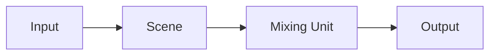

他ソフトのInput、Source、カメラ入力に相当します。  

| | 役割 |
| --- | --- |
| Input | カメラ、ファイル、NDI/OMT、カラーなどの映像ソース |
| Scene | Inputをレイヤーとして重ねた合成 |
| Mixing Unit | SceneをPreview/Programに載せ、CUT/AUTO/Tバーで切替 |
| Output | 選んだソースをNDI/OMTへ送出 |

OutputのソースはInput、Scene、Mixing UnitのPreview/Program、Multiviewから選べます。既定はMixing UnitのProgramです。  
InputはMixing UnitとOutputにも直接載せられます。

## 種類

メインウィンドウのInputsから追加します。

- カラー/バー/ブラック
- 静止画
- 動画ファイル
- UVC（キャプチャデバイス）
- NDI/OMT
- Mix（Mixing UnitのPreview/Program、またはセッションMultiviewと、1–8フレームのFrame Buffer。音声は対象のAudio BusかNone）

Sceneのレイヤー、Mixing Unitのバス、Multiviewのタイル、Outputのソースとして使います。  
入力プレビューはGPUから読み戻したサムネで、映像出力先ウィンドウの枠は使いません。

## タグ

Inputには複数のタグを付けられます。タグはセッションのカタログに残り、どのInputにも付いていないタグもタブとして出ます。

### 付け方

Inputsの追加/編集ダイアログで、タグをチェックして付けます。同じダイアログから新しいタグを追加できます。  
1つのInputに複数付けられます。

### 一覧の絞り込み

Inputs一覧の上にタブが並んでいます。どれか1つを選ぶと、その条件に合うInputだけが出ます。

- **すべて** — 全部
- **各タグ** — そのタグが付いたもの
- **Kind** — Colours / Still / Video / OMT / NDI® / Video Capture / Mix

### タグの管理

タブ帯を右クリックして、タグの追加、名前変更、削除ができます。

- 改名すると、付いているInputも新しい名前に追従します
- 削除すると、各Inputから外れます。表示中のタブを消した場合は「すべて」に戻ります

詳細は[Scenes](/eiviz/ja/concepts/scenes/)、[Mixing Unit](/eiviz/ja/concepts/mixing-unit/)、[Outputs](/eiviz/ja/concepts/outputs/)をご参照ください。
