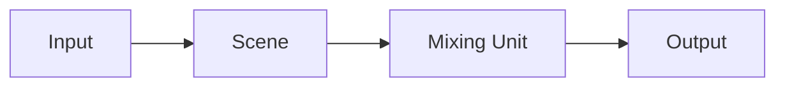

# Inputs

映像は**Input → Scene → Output**の順で扱います。Mixing Unitは、SceneをPreviewとProgramに載せて切り替える単位です。

| | 役割 |
| --- | --- |
| Input | カメラ、ファイル、NDI/OMT、カラーなどの映像ソース |
| Scene | Inputをレイヤーとして重ねた合成 |
| Mixing Unit | SceneをPreview/Programに載せ、CUT/AUTO/Tバーで切替 |
| Output | 選んだソースをNDI/OMTへ送出 |

OutputのソースはInput、Scene、Mixing UnitのPreview/Program、Multiviewから選べます。既定はMixing UnitのProgramです。InputはMixing UnitとOutputにも直接載せられます。

## 種類

メインウィンドウのInputsから追加します。

- カラー/バー/ブラック
- 静止画
- 動画ファイル
- UVC（キャプチャデバイス）
- NDI / OMT

Sceneのレイヤー、Mixing Unitのバス、Multiviewのタイル、Outputのソースとして使います。

[Scenes](/concepts/scenes/) · [Mixing Unit](/concepts/mixing-unit/) · [Outputs](/concepts/outputs/)
