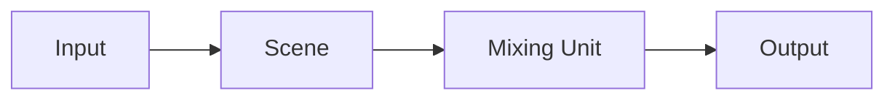

Inputは、eivizに取り込まれるすべての映像・音声入力の基本要素です。一般的なスイッチャーにおけるソースやOBS Studioのソースに該当します。

```mermaid
flowchart LR
  In["Input"] --> Sc["Scene"]
  Sc --> MU["Mixing Unit"]
  MU --> Out["Output"]
```

| 要素 | 役割 |
| --- | --- |
| Input | カメラ、ファイル、ネットワーク伝送等の入力ソース |
| Scene | 複数のInputを重ね合わせた画面構成 |
| Mixing Unit | SceneをPreview/Programで切り替えるM/E |
| Output | 指定したソースを外部ネットワーク（NDI/OMT等）へ送出 |

InputはSceneの構成要素となるだけでなく、Mixing UnitやOutputへ直接割り当てることも可能です。

## サポートする入力ソース

メインウィンドウの「Inputs」から追加できます。

- **カラー/テストパターン**: 単色カラー、カラーバー、ブラック
- **静止画**: PNG、JPEG等
- **動画ファイル**: MP4等（ハードウェアデコード対応）
- **UVCデバイス**: USBウェブカメラ、キャプチャカード
- **ネットワーク受信**: NDI、OMT（OpenMediaTransport）
- **Mix**: 既存のMixing Unit出力やMultiviewをバッファ付き入力として再利用（多段M/E用）
- **Audio**: マイク入力やアプリケーション音声の単独取り込み

## タグとフィルタリング

Inputには複数のタグを設定でき、種別（Kind）やカスタムタグによる絞り込み表示が可能です。

- **タグの付与**: Input追加・編集画面のチェックボックスから設定します。
- **絞り込み**: 一覧上部のタブからタグや入力種別（Colours、Still、Video、OMT、NDI、UVC、Mix等）を選択して表示を絞り込めます。
- **タグの管理**: タブ領域を右クリックすることで、タグの新規作成、名前変更、削除を行えます。
