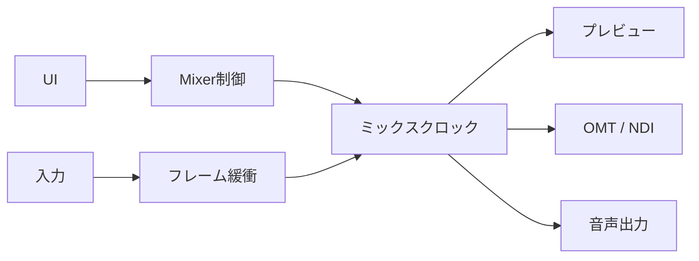
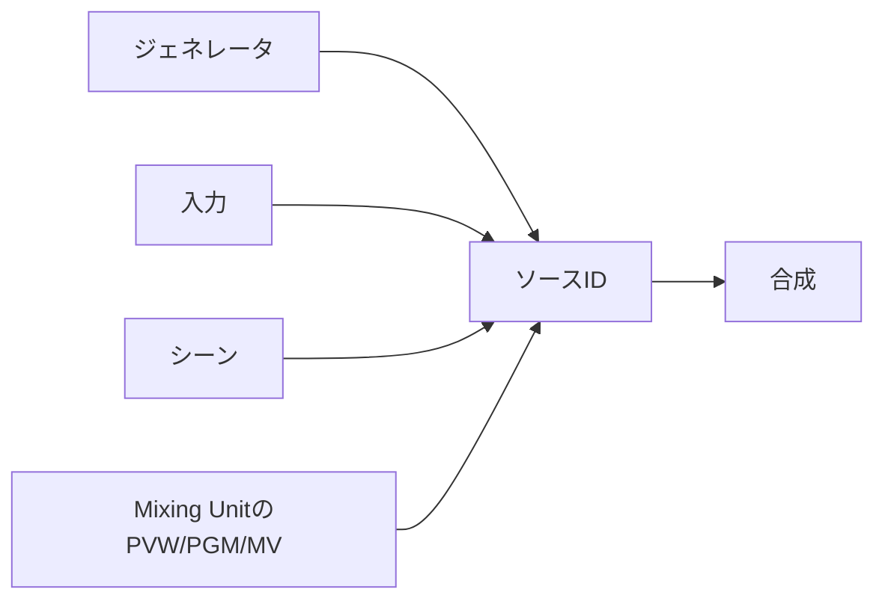
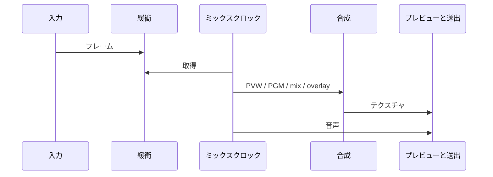
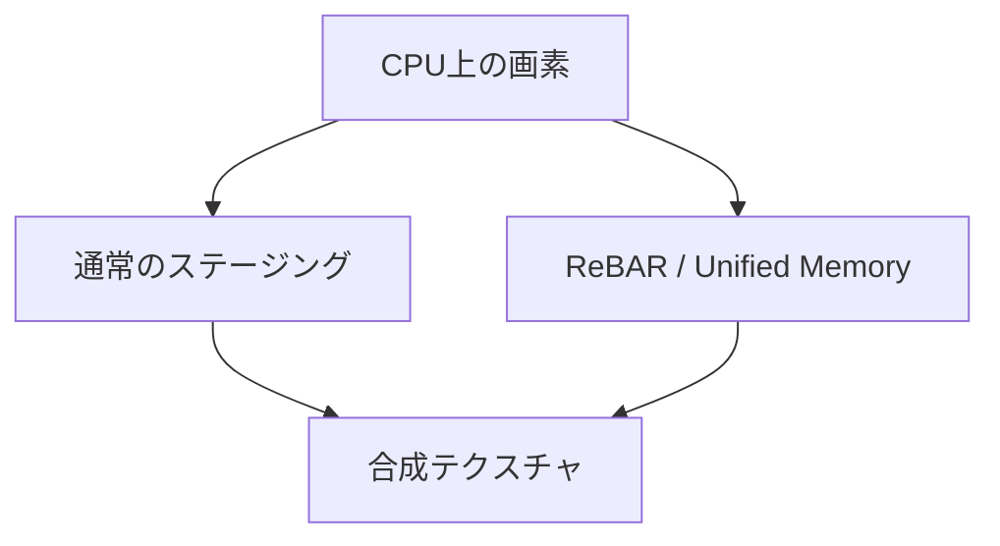

実装者向けの概観です。ファイル名や関数名は意図的に書いていません。概念の定義は[eiviz上の概念](/eiviz/ja/concepts/inputs/)、技術選定は[eivizについて](/eiviz/ja/introduction/about/)です。

## 全体像

プロセスは1つです。映像と音声の状態機械はMixer（Rust + wgpu）にあり、OSごとのUIホストがC ABIでそれを操作します。WindowsはWPF、macOSはSwiftUIです。Linuxホストは未実装です。

ホストはウィンドウ・操作・プレビュー面の提供などを含むUI表示と操作面の提供を担当します。合成、入力の取り込み、出力の送出、セッションJSONの正規化はcore/Mixerが担当することで、高いパフォーマンスとクロスプラットフォームを両立しています。

## 責務

| | Mixer | ホスト |
| --- | --- | --- |
| 合成・トランジション | 担当 | 操作を伝える |
| GPUと音声デバイス | 担当 | 設定を渡す |
| プレビュー表示 | ネイティブ面へ描く | 面（HWND / NSView）を用意する |
| セッションファイル | 正。読み書きと正規化 | 編集用の写しを持つ。開いたあとに状態を打ち直す |
| ウィンドウとテーマ | 知らない | 担当 |

Mixerはプロセスに1つです。プレビュー以外、ホストへGPUポインタは渡しません。入力・シーン・Mixing Unitは整数IDで指します。

## 並行性

UIスレッドは操作と面の寿命だけを扱います。ミックスクロックはマスターFPSで合成とプレビュー提示を回します。入力（ファイル、UVC、NDI、OMT）は別経路でフレームを溜め、クロックはそれを拾います。ネットワーク送出と音声デバイスI/Oもクロックから切り離します。

遅れが大きいときは合成を飛ばし、音声だけ進めて時計を戻します。プレビューが止まっても本線の音が貯まらないようにするためです。映像は数フレーム遅らせて音声と揃えます。

Windowsでは重い操作をUIから外すキューがあります。Tバーのように毎フレーム追従するものは同期です。macOSではプレビュー面の作成だけAppKitのmainに載せます。

## ソースの指し方

カラーやバーなどのジェネレータ、ユーザーが足した入力、シーンの合成結果、Mixing UnitのPreview/Program/Multiviewは、同じ「ソースID」空間に載ります。あるユニットのProgramを別ユニットの入力にできるのはそのためです。

## 1フレーム

入力スレッドが最新フレームを置く → Mixing UnitごとにPreviewとProgramを描き、TバーやAUTOのmixで混ぜ、オーバーレイとマルチビューを載せる → プレビュー面へ出す → 必要なら送出用にパックまたはGPUのまま渡す → 同じ刻みで音声バスを混ぜる。

CUTは即入れ替え、AUTOは時間でmixを動かす、Tバーはホストがmixを書きます。FADEとDIPはそのmixをシェーダで解釈します。

## GPU

合成はwgpuの上で、WindowsはDirect3D 12、macOSはMetalです。CPUからの映像はシステムメモリ経由でアップロードされます。

外部GPUでResizable BARが使えるWindowsでは、CPUからVRAMへ直接アップロードすることで高いパフォーマンスを実現しています。Apple SiliconはUnified Memoryで類似の機能が実装されています。

ファイルやUVCは、可能な場合GPU上でデコードして合成フォーマットへ変換します。  
NDIなどCPUヘビーな処理にCPUを割くため、可能な限りGPUを活用しています。この挙動は設定で変更が可能です。

## 音声

48 kHzのグラフです。MasterとHeadphoneが固定で、AUXを追加可能です。入力はバスマスクとゲイン、Mixing UnitはProgram/Previewに追従してバスへ送れます。オーバーレイはAudio Followを持てます。

ライブ入力は取り込みを抑え、ファイルは絵より音が先行しないように同期します。

## 出力

| | 映像 | 状態 |
| --- | --- | --- |
| OMT | GPUに載せたまま送るか、CPUへ戻してエンコードするか選べる | 実装済み |
| NDI | CPU経路 | 実装済み |
| DeckLink | — | UIにあるが、このビルドでは未接続 |

OMT受信は、Preview/Programに乗っているときだけフル品質、外れたら帯域を落とします。TAKEやTバーで受信を作り直さないよう、外れてもしばらくフルを維持します。

## ホスト

Windowsは子ウィンドウ（HWND）をプレビュー面にします。macOSはNSViewを渡し、wgpuがMetalレイヤを付けます。レイアウトは両OSで揃えています。

LinuxはGPUバックエンドもUIもまだありません。予定スタックは[eivizについて](/eiviz/ja/introduction/about/)です。
