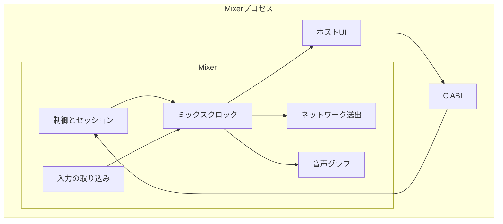
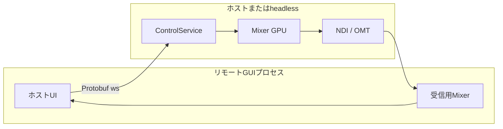
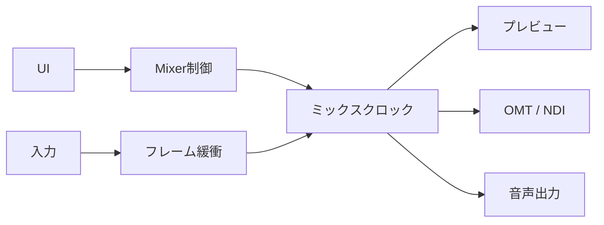
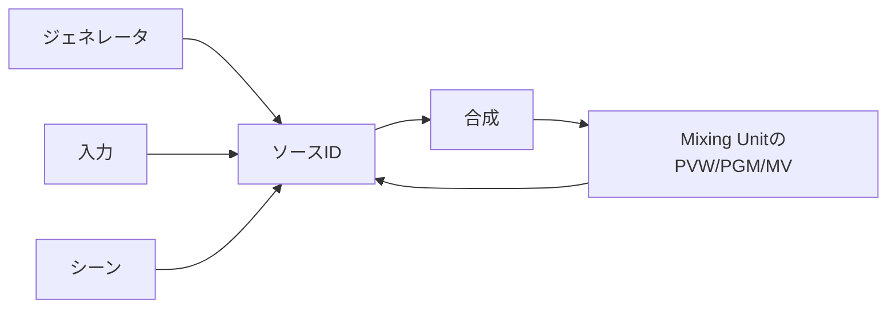
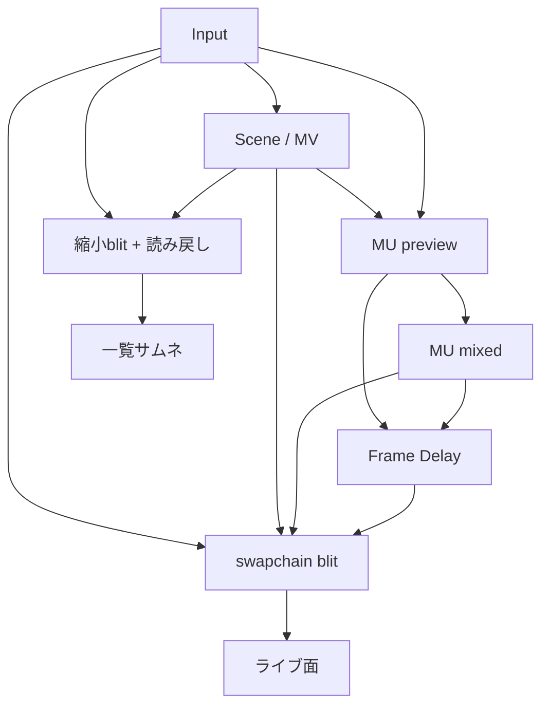
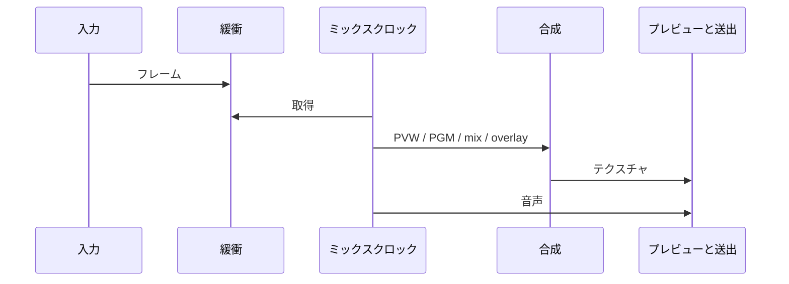
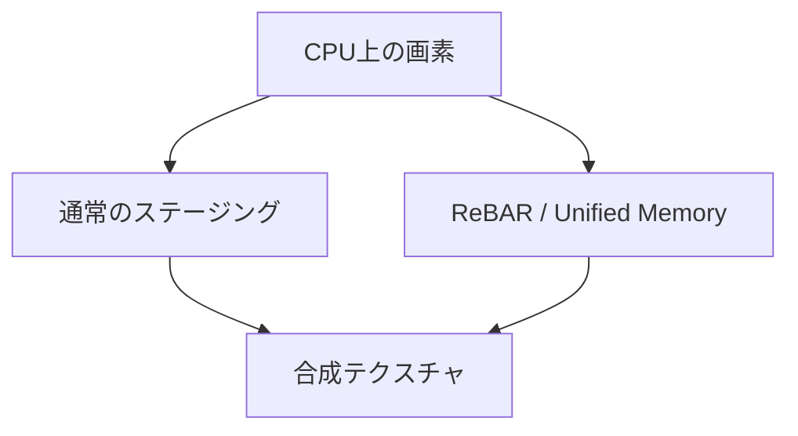

eivizのシステムアーキテクチャです。 プラットフォームを問わずある程度共通です。

## 全体像

eivizの映像合成はMixerを1プロセスとして動かします。  
映像と音声の状態機械はMixer（Rust + wgpu）にあり、OSごとのUIホストが内部のC ABIでそれを操作します。ホスト実装は`hosts/win32`（WPF）、`hosts/macos`（SwiftUI）、`hosts/linux`（開発中）です。

ホストはウィンドウ、操作、プレビュー面など、UI表示と操作を担当します。  
映像合成、音声処理、入出力の管理、セッションデータはMixerが担当し、根幹の処理をUIから完全に分離することで高いパフォーマンスとクロスプラットフォームを両立しています。

外部からの制御はMixer内の`ControlService`が担当しています。vMix互換HTTP（既定8088）、vMix互換TCP（8099）、Protobuf WebSocket（既定9400）は同じ経路を通ってディスパッチャーへ入ります。  

Windows/macOSは`Eiviz.Remote.exe`/`eiviz-remote.app`としても起動できます。クライアントは受信用のMixerと`eiviz_remote`を読み、操作は接続先の`ControlService`へ送ります。プロトコルは[eiviz API](/eiviz/ja/developers/api/)をご確認ください。

## 責務

| | Mixer | ホスト |
| --- | --- | --- |
| 合成・トランジション | 担当 | 操作を伝える |
| GPUと音声デバイス | 担当 | 設定を渡す |
| ライブプレビュー | ネイティブ面へ描く | 面（HWND / NSView）を用意する |
| シーンタイルなど | GPUから読み戻す | サムネを表示する |

Mixerはプロセスに1つです。ライブプレビュー以外、ホストへGPUポインタは渡しません。入力・シーン・Mixing Unitは整数IDで指します。

リモート接続時のプロセス構成は上図です。操作手順は[リモート接続](/eiviz/ja/features/remote/)をご確認ください。

## 並行性

UIスレッドは、操作と映像の表示を扱います。  
ファイル、UVC、NDI、OMTなどの入力は別経路でフレームを溜め、一定間隔ごとにMixerがフレームを処理します。

処理が遅れた場合は合成をスキップし、音声だけ進めることでリアルタイムに復帰します。
映像は数フレームバッファーを持たせて音声と揃えます。

## ソースの指し方

単色InputやColour Barなどのジェネレータや、セッションに追加した映像入力、シーンの合成結果、Mixing UnitのPreview/Program/Multiviewは、全て同じ**ソースID空間**に載ります。  
このため、Mixing UnitのProgramを別Mixing Unitの映像入力として処理することが可能です。

## テキスチャ

Input、Scene、Mixing UnitのPreview/Program、Multiviewは、同じソースID空間の**GPUテキスチャ**です。合成とGUIは、その`TextureView`をサンプリングします。

| 種別 | 実体 |
| --- | --- |
| Input | 取り込み結果。GPU経路はハンドル共有、CPU経路は1枚へ上書き |
| Scene | レイヤーを描いた合成結果 |
| Multiview | Sceneと同じ実体。ラベルとタリーを足す |
| Preview | Mixing Unitのpreview |
| Program | mixとオーバーレイ後のmixed。GUIと送出が指す |

Programは切替前の`program`と、本線の`mixed`を持ちます。合成は使用中のSceneを描き、セッション上のSceneテキスチャは保持します。

### GUIへの経路

ホストはウィンドウ面を用意し、Mixerがそこに描きます。経路は2本です。

ライブのPreview/Program、開いているMultiview、Scene Editor、Overlay窓は、既存のViewをHWND/NSViewのswapchainへblitします。同じソースを複数のライブ面に出すと、面の数だけblitします。

Input一覧、Scene一覧、スイッチャーのソースボタンは、最大960×540へ縮小してGPUから読み戻します。

### GPU上のコピー

次のコピーがフレーム処理に入ります。

- Frame Delay。`mixed`と`preview`をリングへコピーし、音声と揃えます。GUIのPreview/Programもこの遅延面を見ます
- トランジション履歴。`mixed`を`prev`へコピーします
- 送出。CPU encodeを選択した場合、UYVY形式で読み出し、CPU上の送出専用スレッドでVMXコーデックへの変換・送信を行います。GPU経路のOMTは出力ごとの送出スロットへコピーします

sort/flow/bloomなどの中間バッファはVRAMにあり、該当トランジションのときに計算します。

## 1フレーム

1フレームは次の3レーンです。

1. 本線の取り込み。毎マスターフレーム
2. 本線の合成（Preview/Program/出力）。毎マスターフレーム
3. 監視用の合成（Sceneタイル、入力プレビュー）と、そのソースの取り込み。更新間隔のとき

本線のソースは毎フレームGPUへ載せます。MonitorとサムネのInputは、それぞれの更新間隔でGPUへ載せます。OMT受信の品質判定は、開いている監視面を毎フレーム見ます。

そのうえで流れは次のとおりです。

1. 入力スレッドが最新フレームを置く
2. Mixing UnitごとにPreviewとProgramを描き、TバーやAUTOのmixで混ぜ、オーバーレイとマルチビューを載せる
3. 送出する出力へUYVYパック、またはGPUスロットへコピーする
4. 各出力毎に1スレッド割り当てられ、圧縮とネットワーク送信を行う
5. 同じマスターティックで音声バスを混ぜ、各出力へ載せる。Multiviewを映像ソースに選択した場合、音声の送出は出来ません

## GPU

映像合成はwgpuを利用した抽象化レイヤーでGPU処理を呼び出しています。WindowsはDirect3D 12、macOSはMetalです。  
CPUからの映像は、通常はシステムメモリ経由でアップロードされます。

外部GPUでResizable BARが使えるWindows環境では、wgpuのハードウェア抽象化を抽出し、DX12のローレベルAPIに直接アクセスすることでCPUからVRAMへ直接書き込み高いパフォーマンスを実現しています。  
Apple SiliconはUnified Memoryで類似の経路を使います。

ファイルやUVCは、可能な場合GPU上でデコードして合成フォーマットへ変換します。  
NDIなどCPU負荷の高い処理にCPUを割くため、可能な限りGPUを活用しています。  
この挙動は[設定](/eiviz/ja/introduction/settings/)から変更できます。

## 音声

内部ミックスは48 kHzのグラフです。MasterとHeadphoneが固定で、AUXを追加できます。  
入力はバスマスクとゲインを持ち、Mixing UnitはProgramに追従した音声(Audio Follow)をバスへ送れます。オーバーレイも同様にAudio Followを設定可能です。

[Audio Auxs](/eiviz/ja/concepts/audio-auxs/)をご確認ください。

## 出力

| | 映像 | 状態 |
| --- | --- | --- |
| OMT | GPUに載せたまま送るか、CPU encodeを選択した場合はUYVY形式で読み出し送出専用スレッドでVMXへ変換する | 実装済み |
| NDI | CPU経路 | 実装済み |
| DeckLink | — | 現在実装中 |

各出力毎に1スレッド割り当てられます。

OMT受信は、Preview/Programに乗っているときだけフル品質、外れたら帯域を落とします。  
TAKEやTバーで受信を作り直さないよう、外れてもしばらくフル品質を維持します。

[設定](/eiviz/ja/introduction/settings/)の出力と[NDI/OMT](/eiviz/ja/features/outputs/ndi-omt/)をご確認ください。

## ホスト

OSごとのホストは`hosts/win32`、`hosts/macos`、`hosts/linux`に分かれます。ライブのPreview/Program、開いているMultiview、Scene Editor、Overlay窓、スイッチャーのPreview/Programは、ネイティブ面へMixerが直接描きます。Windowsは子ウィンドウ（HWND）、macOSはNSViewにwgpuがMetalレイヤを付けます。

リモート接続時のライブ面は、接続先のNDI/OMT出力の受信です。手順は[リモート接続](/eiviz/ja/features/remote/)をご確認ください。Mix InputはMixing UnitのバスまたはセッションMultiviewの遅延エイリアスで、FrameDelayのリングを読み、同じサムネ経路を使います。

WindowsのDXGI flip面（swapchain）は同時に多く作れません。[設定](/eiviz/ja/introduction/settings/)の映像出力先ウィンドウの上限が、開いているswapchainの本数を抑えます。Preview/Program/Multiviewをリアルタイムに表示するのに使います。たとえばSwitcher UIはPreviewとProgramを出すので2スロット使います。設定から上げられますが、不安定になる可能性があります。窓を閉じるとswapchainは外れ、枠が空きます。本体ウィンドウを閉じると補助窓も閉じてプロセスを終了します。

セッションを開き直すと本体ウィンドウを作り直し、プレビュー面を最初のレイアウトで付け直します。HWNDをMixerの世代をまたいで使いません。

