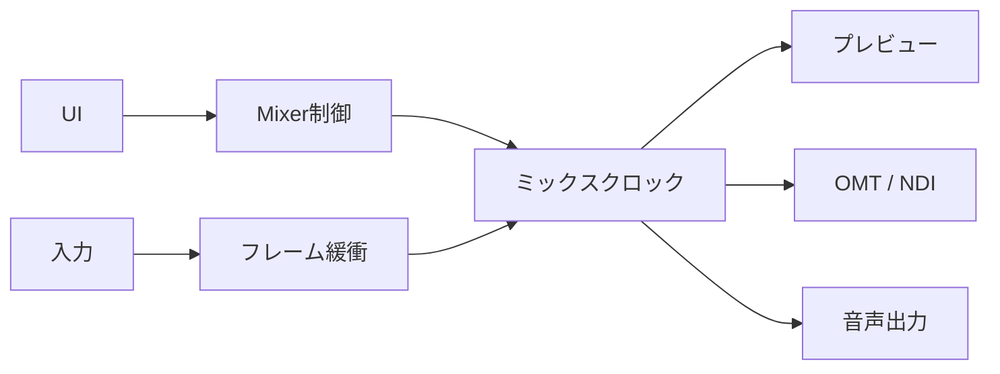
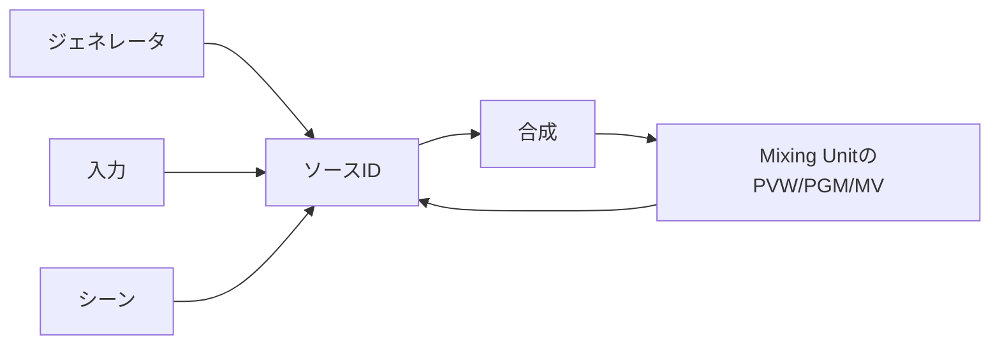
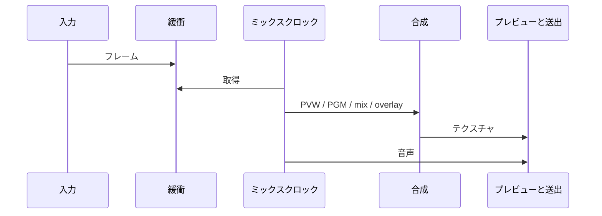
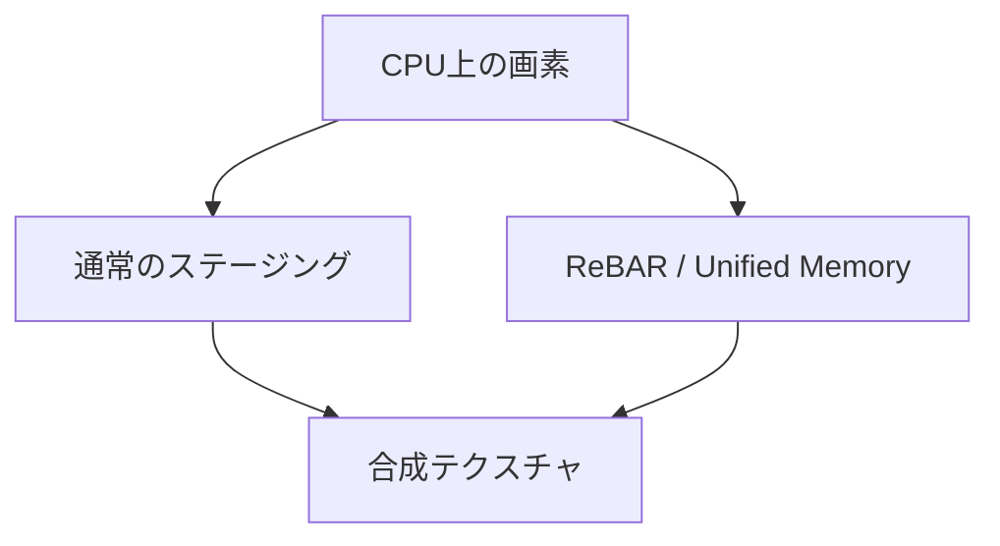

eivizのシステムアーキテクチャです。 プラットフォームを問わずある程度共通です。

## 全体像

eivizは1プロセスで動作します。  
映像と音声の状態機械はMixer（Rust + wgpu）にあり、OSごとのUIホストがC ABIでそれを操作します。WindowsはWPF、macOSはSwiftUIです。Linuxホストは未実装です。

ホストはウィンドウ、操作、プレビュー面など、UI表示と操作を担当します。  
映像合成、音声処理、入出力の管理、セッションデータはMixerが担当し、根幹の処理をアーキテクチャ上UIから完全に分離することで高いパフォーマンスとクロスプラットフォームを両立しています。

## 責務

| | Mixer | ホスト |
| --- | --- | --- |
| 合成・トランジション | 担当 | 操作を伝える |
| GPUと音声デバイス | 担当 | 設定を渡す |
| ライブプレビュー | ネイティブ面へ描く | 面（HWND / NSView）を用意する |
| シーンタイルなど | GPUから読み戻す | サムネを表示する |

Mixerはプロセスに1つです。ライブプレビュー以外、ホストへGPUポインタは渡しません。入力・シーン・Mixing Unitは整数IDで指します。

## 並行性

UIスレッドは、操作と映像の表示を扱います。  
ファイル、UVC、NDI、OMTなどの入力は別経路でフレームを溜め、一定間隔ごとにMixerがフレームを処理します。

処理が遅れた場合は合成をスキップし、音声だけ進めることでリアルタイムに復帰します。
映像は数フレームバッファーを持たせて音声と揃えます。

## ソースの指し方

単色InputやColour Barなどのジェネレータや、セッションに追加した映像入力、シーンの合成結果、Mixing UnitのPreview/Program/Multiviewは、全て同じ**ソースID空間**に載ります。  
このため、Mixing UnitのProgramを別Mixing Unitの映像入力として処理することが可能です。

## 1フレーム

1フレームの流れは次のとおりです。

1. 入力スレッドが最新フレームを置く
2. Mixing UnitごとにPreviewとProgramを描き、TバーやAUTOのmixで混ぜ、オーバーレイとマルチビューを載せる
3. 映像合成バスへ送信する
4. 必要なら送出用に圧縮する。またはGPUテキスチャのまま渡す
5. 同じタイミングで音声バスを混ぜる

## GPU

映像合成はwgpuを利用した抽象化レイヤーでGPU処理を呼び出しています。WindowsはDirect3D 12、macOSはMetalです。  
CPUからの映像は、通常はシステムメモリ経由でアップロードされます。

外部GPUでResizable BARが使えるWindows環境では、wgpuのハードウェア抽象化を抽出し、DX12のローレベルAPIに直接アクセスすることでCPUからVRAMへ直接書き込み高いパフォーマンスを実現しています。  
Apple SiliconはUnified Memoryで類似の経路を使います。

ファイルやUVCは、可能な場合GPU上でデコードして合成フォーマットへ変換します。  
NDIなどCPU負荷の高い処理にCPUを割くため、可能な限りGPUを活用しています。  
この挙動は[設定](/eiviz/ja/introduction/settings/)から変更できます。

## 音声

内部ミックスは48 kHzのグラフです。MasterとHeadphoneが固定で、AUXを追加できます。  
入力はバスマスクとゲインを持ち、Mixing UnitはProgramに追従した音声(Audio Follow)をバスへ送れます。オーバーレイも同様にAudio Followを設定可能です。

詳細は[Audio Auxs](/eiviz/ja/concepts/audio-auxs/)をご参照ください。

## 出力

| | 映像 | 状態 |
| --- | --- | --- |
| OMT | GPUに載せたまま送るか、CPUへ戻してエンコードするか選べる | 実装済み |
| NDI | CPU経路 | 実装済み |
| DeckLink | — | 現在実装中 |

OMT受信は、Preview/Programに乗っているときだけフル品質、外れたら帯域を落とします。  
TAKEやTバーで受信を作り直さないよう、外れてもしばらくフル品質を維持します。

詳細は[設定](/eiviz/ja/introduction/settings/)の出力と[NDI/OMT](/eiviz/ja/features/outputs/ndi-omt/)をご参照ください。

## ホスト

ライブのPreview/Program、開いているMultiview、Scene Editor、Overlay窓、スイッチャーのPreview/Programは、ネイティブ面へMixerが直接描きます。Windowsは子ウィンドウ（HWND）、macOSはNSViewにwgpuがMetalレイヤを付けます。

シーンタイル、スイッチャーのシーンサムネ、入力プレビューはGPUから読み戻したサムネです。シーンを増やしてもswapchainは増えません。

WindowsのDXGI flip面（swapchain）は同時に多く作れません。[設定](/eiviz/ja/introduction/settings/)の映像出力先ウィンドウの上限が、開いているswapchainの本数を抑えます。Preview/Program/Multiviewをリアルタイムに表示するのに使います。たとえばSwitcher UIはPreviewとProgramを出すので2スロット使います。設定から上げられますが、不安定になる可能性があります。窓を閉じるとswapchainは外れ、枠が空きます。本体ウィンドウを閉じると補助窓も閉じてプロセスを終了します。

セッションを開き直すと本体ウィンドウを作り直し、プレビュー面を最初のレイアウトで付け直します。HWNDをMixerの世代をまたいで使いません。

