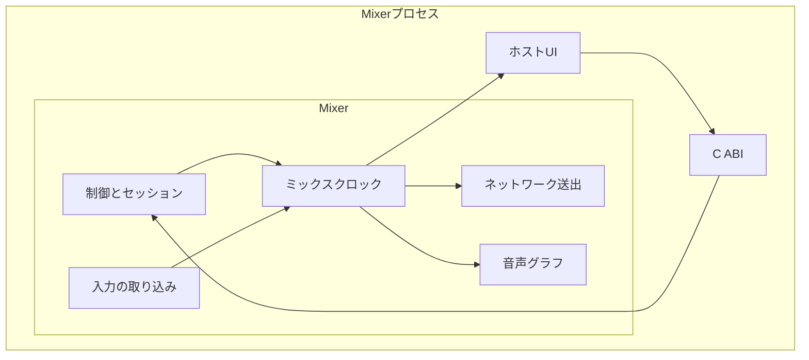
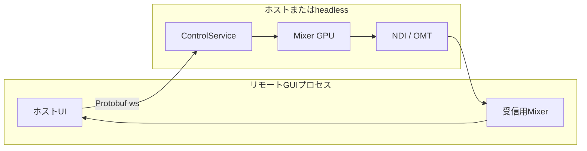
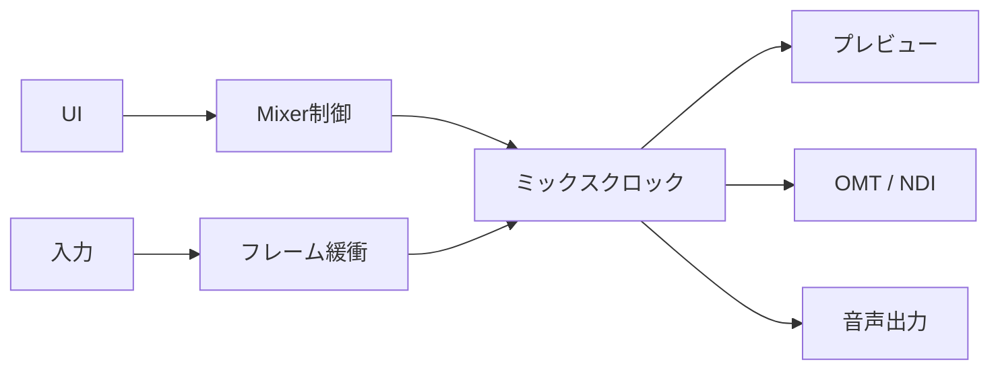
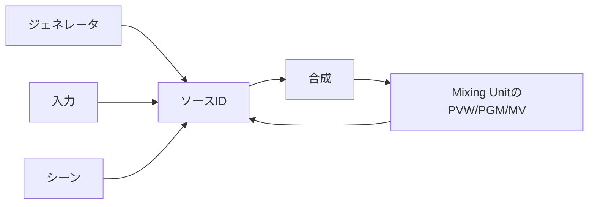
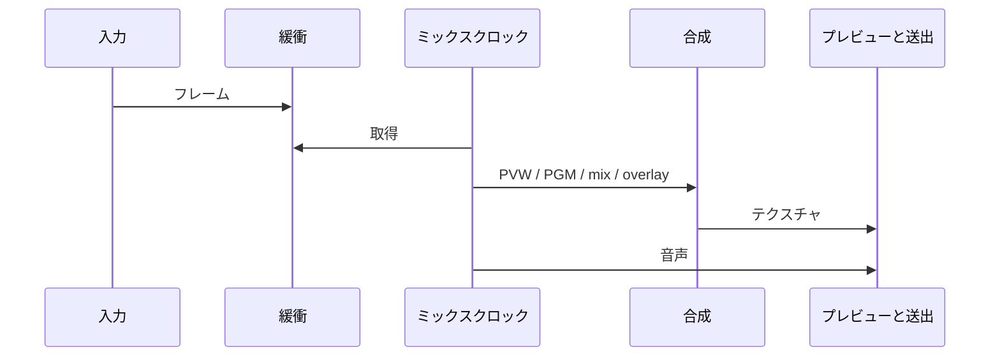

eivizの全体設計と処理の流れについて解説します。

## 全体像

eivizは、映像・音声合成を担うバックエンド「Mixer」と、各OS向けのフロントエンド「ホストUI」を明確に分離した設計を採用しています。

- **Mixer（Rust + wgpu）**: 映像合成、音声ミックス、入力取り込み、ネットワーク送出、セッション管理を担います。
- **ホストUI**: 操作インターフェースの提供やプレビュー描画領域の確保を行い、内部のC ABIを通じてMixerと通信します。

外部からの制御（vMix互換HTTP/TCP、Protobuf WebSocket）はMixer内の`ControlService`が一元的に受け付け、ディスパッチャを経由して処理されます。

```mermaid
flowchart TB
  subgraph proc["Mixerプロセス"]
    host["ホストUI"]
    abi["C ABI"]
    subgraph mixer["Mixer"]
      ctrl["制御とセッション"]
      clock["ミックスクロック"]
      ingest["入力の取り込み"]
      send["ネットワーク送出"]
      audio["音声グラフ"]
    end
  end
  host --> abi --> ctrl
  ctrl --> clock
  ingest --> clock
  clock --> send
  clock --> audio
  clock --> host
```

リモート接続時は、クライアント側の`Eiviz.Remote`がWebSocketで接続先ホストの`ControlService`にコマンドを送り、映像はNDIまたはOMT経由で受信します。

```mermaid
flowchart LR
  subgraph client["リモートGUIプロセス"]
    rui["ホストUI"]
    recv["受信用Mixer"]
  end
  subgraph server["ホストまたはheadless"]
    ctrl2["ControlService"]
    gpu["Mixer GPU"]
    ndi["NDI / OMT"]
  end
  rui -->|Protobuf ws| ctrl2
  ctrl2 --> gpu
  gpu --> ndi
  ndi --> recv
  recv --> rui
```

## 責務の分離

| 領域 | Mixer | ホストUI |
| --- | --- | --- |
| 映像合成・トランジション | 実行 | 操作要求を発行 |
| デバイス制御（GPU/音声） | 管理・入出力 | 設定値を渡す |
| リアルタイムプレビュー | ネイティブサーフェスへ描画 | ウィンドウハンドル（HWND/NSView）を提供 |
| サムネイル・シーン一覧 | GPUから縮小読み戻し | UIへの表示 |

MixerとUIの間では、リアルタイム描画用のサーフェスを除いてGPUポインタの直接受け渡しは行わず、リソースは整数IDで管理されます。

## 並行処理とクロック同期

UIスレッド、映像入力スレッド、音声処理、ネットワーク送出はそれぞれ独立したスレッドで動作します。

- 映像入力は各ソース専用のスレッドでバッファに蓄積され、マスタークロックの周期でMixerへ供給されます。
- 処理遅延が発生した場合は映像合成をスキップし、音声クロックを優先することでリアルタイム性を保ちます。
- 映像と音声の同期はフレームバッファ（既定3フレーム）によって維持されます。

```mermaid
flowchart LR
  ui["UI"] --> mixer["Mixer制御"]
  cap["入力"] --> buf["フレーム緩衝"]
  mixer --> clock["ミックスクロック"]
  buf --> clock
  clock --> pvw["プレビュー"]
  clock --> net["OMT / NDI"]
  clock --> spk["音声出力"]
```

## ソース管理とGPUテクスチャ

単色ジェネレータ、カメラ入力、動画ファイル、Sceneの合成結果、Mixing UnitのPreview/Program出力は、すべて同一の**ソースID空間**で管理されます。これにより、あるMixing Unitの出力を別のMixing Unitの入力レイヤーとして再帰的に利用できます。

```mermaid
flowchart LR
  gen["ジェネレータ"] --> id["ソースID"]
  inp["入力"] --> id
  scene["シーン"] --> id
  mu["Mixing UnitのPVW/PGM/MV"] --> id
  id --> compose["合成"]
  compose --> mu
```

内部的には各ソースがGPUテクスチャ（`TextureView`）として保持されており、合成エンジンやGUIプレビューはそれらをサンプリングして描画します。

## 1フレームの処理フロー

マスターフレームの1サイクルは以下の流れで進行します。

1. **入力取り込み**: 各入力スレッドが最新フレームを確定。
2. **映像合成**: Mixing UnitごとにPreviewとProgramを描画し、トランジションやOverlay、Multiviewを合成。
3. **送出準備**: 出力設定に応じてGPUスロットへのコピー、またはUYVY形式でのCPU読み出しを実行。
4. **エンコードと送信**: 出力先ごとに割り当てられたスレッドが圧縮とネットワーク送信を実行。
5. **音声処理**: 同一のタイムスタンプで音声バスをミックスし、各出力へ送出。

```mermaid
sequenceDiagram
  participant Cap as 入力
  participant Buf as 緩衝
  participant Clock as ミックスクロック
  participant GPU as 合成
  participant Out as プレビューと送出
  Cap->>Buf: フレーム
  Clock->>Buf: 取得
  Clock->>GPU: PVW / PGM / mix / overlay
  GPU->>Out: テクスチャ
  Clock->>Out: 音声
```

## GPU最適化

映像パイプラインはwgpuをベースとしつつ、プラットフォーム固有の高速化を行っています。

- **Windows**: Direct3D 12を使用。Resizable BAR（ReBAR）対応環境ではCPUからVRAMへ直接書き込みを行うことで、システムメモリ経由のコピーを削減します。
- **macOS**: Metalを使用。Apple Silicon環境ではUnified Memoryを活かし、共有メモリ領域経由で効率的な転送を行います。
- ファイル再生やUVC入力は可能な限りGPUデコーダーを活用し、CPU負荷を低減します。

## 音声パイプライン

内部では48 kHzステレオのオーディオグラフを処理します。各Mixing Unitが専用のMU Busを1本持ちます。ヘッドホンは、メーターのヘッドホンアイコンで選択したMixing UnitまたはInputの音声を出力します。Inputは送り先のMixing Unitとゲインの設定を持ち、FollowではPreview/Programの切り替えに連動します。Overlayの音声も連動可能です。詳細は[MU Bus](/eiviz/ja/concepts/audio-auxs/)を参照してください。
